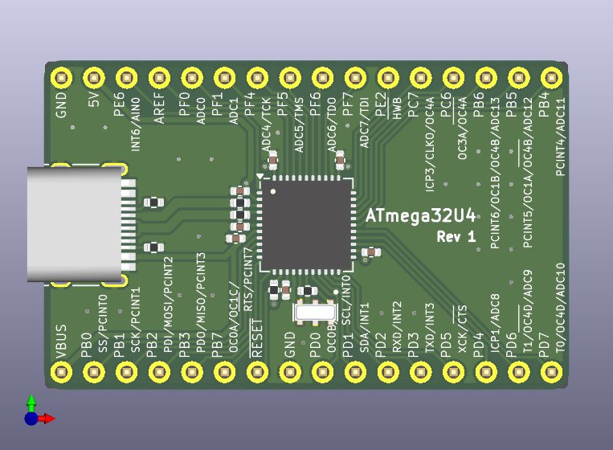

# atmega32u4-prototyping-board

The simple development board featuring only the essential components for the ATmega32U4: bypass capacitors, USB Type-C connector, clock circuit, and a pull-up resistor for RESET.

The VBUS and 5V input lines are separated, allowing you to switch between self-powered and bus-powered modes via external wiring.

- [ATmega32U4 datasheet](https://ww1.microchip.com/downloads/en/DeviceDoc/Atmel-7766-8-bit-AVR-ATmega16U4-32U4_Datasheet.pdf)

## Ceramic Resonator Selection

The base part number of the ceramic resonator used in compact Arduino-compatible boards with the ATmega32U4 appears to be Murata's CSTNE16M0V\* ([reference](https://electronics.stackexchange.com/a/665240)). Suitable ceramic resonators can be searched using Murata’s [SimSurfing: IC-タイミングデバイス検索ツール](https://ds.murata.co.jp/simsurfing/ic-timing-device.html). Since the ATmega32U4 itself is not listed, searches were performed using ATmega32M1 and ATmega32C1 instead.

The difference between [CSTNE16M0V53C000R0](https://www.digikey.jp/ja/products/detail/murata-electronics/CSTNE16M0V53C000R0/8747730) and [CSTNE16M0VH3C000R0](https://www.digikey.jp/ja/products/detail/murata-electronics/CSTNE16M0VH3C000R0/8747732) lies in their frequency tolerance, with the latter offering higher precision. The former is more affordable, so it is the one being used.

- [CSTNE16M0V53C000R0|セラミック発振子/水晶振動子|タイミングデバイス|村田製作所](https://www.murata.com/ja-jp/products/productdetail?partno=CSTNE16M0V53C000R0)
- [CSTNE16M0V53C000R0 footprint & symbol by Murata | SnapMagic Search](https://www.snapeda.com/parts/CSTNE16M0V53C000R0/Murata/view-part/)

2025-05-09T04:07:26.697Z

<figure>
<figcaption><a href="https://ds.murata.co.jp/simsurfing/ic-timing-device.html?lcid=ja&icmaker=Microchip&icname=ATmega32M1&tdhin=CSTNE16M0V&spec_application=0&supplystatus=0&kosa=0&tempL=0&tempH=0">ATmega32M1</a></figcaption>

|IC品名|IC備考|ICメーカー|品番|適用用途[^1]|ステータス[^2]|発振周波数\[MHz]|周波数許容偏差|CL1\[pF][^3]|CL2\[pF][^4]|Rf\[ohm]|Rd\[ohm]|IC電圧(min.)\[V]|IC電圧(max.)\[V]|使用温度(min.)\[deg.C]|使用温度(max.)\[deg.C]|IC Application|
|---|---|---|---|:---:|:---:|---|---|---|---|---|---|---|---|---|---|---|
|ATmega32M1|CKSEL:111|Microchip|CSTNE16M0V53C000R0|`APS`|`生産中`|16|+/-0.5%|15|15|Open|0|4.5|5.5|-40|125||
|ATmega32M1|CKSEL:111|Microchip|CSTNE16M0VH3C000R0|`APS`|`生産中`|16|+/-0.07%|15|15|Open|0|4.5|5.5|-40|125||

</figure>

[^1]: <dl><dt><code>CE</code></dt><dd>民生機器</dd><dt><code>IE</code></dt><dd>産業機器</dd><dt><code>AIC</code></dt><dd>自動車用インフォテインメント / コンフォート機器</dd><dt><code>APS</code></dt><dd>自動車用パワートレイン / セーフティ機器</dd><dt><code>MAB</code></dt><dd>医療機器 [GHTF A/B]</dd><dt><code>MC</code></dt><dd>医療機器 [GHTF C]</dd><dt><code>MD</code></dt><dd>医療機器 [GHTF D]</dd><dt><code>MeI</code></dt><dd>インプラント除く医療機器 [GHTF A/B/C]</dd><dt><code>MI</code></dt><dd>インプラント医療機器または医療機器 [GHTF D]</dd><dt><code>MeS</code></dt><dd>インプラント・手術・自動投与用途除く医療機器 [GHTF A/B/C]</dd><dt><code>ME</code></dt><dd>モバイル機器</dd><dt><code>MC</code></dt><dd>モバイル通信</dd><dt><code>IeT</code></dt><dd>運輸・設備・商用エネルギー関連を除く産業機器</dd><dt><code>CDT</code></dt><dd>民生機器-差動伝送</dd><dt><code>HDD</code></dt><dd>HDD</dd><dt><code>DFD</code></dt><dd>重送検知</dd><dt><code>AaM</code></dt><dd>自動車用機器 <a href="https://www.murata.com/contactform?Product=Capacitor">[ムラタへ問合せ要]</a></dd><dt><code>MaM</code></dt><dd>医療機器 <a href="https://www.murata.com/contactform?Product=Capacitor">[ムラタへ問合せ要]</a></dd></dl>
[^2]: <figure><figcaption>「製品ステータス」の説明</figcaption><dl><dt><code>開発中</code></dt><dd>開発中の製品です。サンプル対応可否、量産時期についてはお問い合わせください。</dd><dt><code>生産中</code></dt><dd>量産、販売中の製品です。</dd><dt><code>NRND</code></dt><dd>新モデルへの部品採用を控えていただきたい製品です。 (Not Recommended for New Design)</dd><dt><code>生産中止予定</code></dt><dd>生産中止予定の製品であり、最終受注期限及び最終生産時期が表示されている場合があります。 最終受注期限までに、必要数量の連絡をお願いします。</dd><dt><code>生産中止</code></dt><dd>生産を中止しており、ご注文を受け付けていない製品です。</dd></dl></figure>
[^3]: 水晶振動子：外付け容量 セラロック：内蔵容量
[^4]: 水晶振動子：外付け容量 セラロック：内蔵容量

<figure>
<figcaption><a href="https://ds.murata.co.jp/simsurfing/ic-timing-device.html?lcid=ja&icmaker=Microchip&icname=ATmega32C1&tdhin=CSTNE16M0V&spec_application=0&supplystatus=0&kosa=0&tempL=0&tempH=0">ATmega32C1</a></figcaption>

|IC品名|IC備考|ICメーカー|品番|適用用途[^1]|ステータス[^2]|発振周波数\[MHz]|周波数許容偏差|CL1\[pF][^3]|CL2\[pF][^4]|Rf\[ohm]|Rd\[ohm]|IC電圧(min.)\[V]|IC電圧(max.)\[V]|使用温度(min.)\[deg.C]|使用温度(max.)\[deg.C]|IC Application|
|---|---|---|---|:---:|:---:|---|---|---|---|---|---|---|---|---|---|---|
|ATmega32C1|CKSEL:111|Microchip|CSTNE16M0V53C000R0|`APS`|`生産中`|16|+/-0.5%|15|15|Open|0|4.5|5.5|-40|125||
|ATmega32C1|CKSEL:111|Microchip|CSTNE16M0VH3C000R0|`APS`|`生産中`|16|+/-0.07%|15|15|Open|0|4.5|5.5|-40|125||

</figure>

## License

The design data for this board is provided under the CERN-OHL-S license. However, the symbol, footprint, and 3D model for library/CSTNE16M0V53C000R0 are provided via SnapMagic Search and are licensed under CC BY-SA (Design Exception 1.0) ([reference](https://www.snapeda.com/about/FAQ/#license)).
